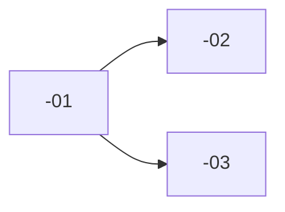

# Write User Stories

You turn a (or several) functional spec into actionable user stories. Each story must be **deliverable end-to-end in under one day** (dev + review + test) and **manually testable by a user via the standalone app, plugin host, or a direct API/CLI invocation**.

The split relies on a _prior_ exploration of the codebase to understand the delta between what exists and the target state — without it, the split produces stories that are either too big (existing code under-estimated) or fictional (real technical constraints ignored).

## Expected output

For each spec processed:

- **Index**: `docs/specs/<spec-slug>/stories.md` — overview + table of stories + dependency graph + notes for the Technical Refinement
- **Individual files**: `docs/specs/<spec-slug>/stories/<spec-slug>-NN-<slug>.md` — one file per story

`<spec-slug>` = folder name under `docs/specs/` (e.g. `docs/specs/mvp/`, which contains `spec.md` + `stories.md` + `stories/`).
`NN` = two-digit number (`01`, `02`, …).
`<slug>` = kebab-case summary of the title (e.g. `latency-counter-ui`).

All content is written in **English**, matching the rest of `docs/`.

---

## Phase 1 — Read the specs

1. If the user passed one or more slugs as arguments, read for each `docs/specs/<slug>/spec.md` with the Read tool.
2. Otherwise, list folders under `docs/specs/` (each folder contains a `spec.md`) and ask which to process (do not guess).
3. For each spec, locate mentally: **Goal**, **Acceptance criteria**, **In scope**, **Out of scope**, **Risks** / **Open questions**. These sections exist in nearly every spec under `docs/specs/`.
4. Also read `docs/specs/product-architecture.md` once per session to anchor the **product layers** (Capture, Signal chain, Render, Tone state, Control surface, Persistence) — they drive how stories are categorised.

Do not move on to Phase 2 until the spec is fully read — a split based on a partial read will be lopsided.

---

## Phase 2 — Parallel exploration of the codebase

To understand the real delta to develop, spawn **in a single message** four `Explore` subagents in parallel. The goal is to map _what already exists_ and _what is missing_ across each layer of the app, so stories can be sized honestly.

Each subagent receives a self-contained brief (it has not seen this conversation). Include in each brief:

- The spec context in 2-3 sentences (copied from the spec)
- The layer to explore (see below)
- The precise question: _"What already exists? What is missing? Which existing patterns should we follow?"_
- A request for a report under 200 words

The 4 subagents — mapped to the product layers:

| Subagent | Layer focus | Looks for |
| -------- | ----------- | --------- |
| A        | **Audio path (Capture + Render)** | Audio I/O setup (cpal or chosen backend), buffer routing, sample-rate/buffer-size handling, xrun detection, latency measurement code. What lives on the realtime thread? What is shell vs core? |
| B        | **Domain (Signal chain + Tone state)** | DSP blocks, signal-chain types, parameter model, NewType wrappers, error types, ports/traits. Pure code with no I/O. Identify what already exists vs what the spec requires. |
| C        | **Control surface (GUI + future MIDI)** | GUI framework setup, widget code, GUI ↔ audio messaging primitive, parameter-change flow. Routes/screens/panels touched by the spec. |
| D        | **Persistence + Tests** | Preset I/O, settings, audio fixtures, test harnesses (unit / integration / e2e). Existing test patterns to follow for new stories. |

If the spec is purely DSP (skip C) or purely GUI (skip D), narrow the briefs accordingly. By default, run all four — better a "nothing to do here" report than missing a layer and discovering it too late.

**If multiple specs are processed at once**, handle them _sequentially_ (Phases 1+2+3+4 for spec 1, then for spec 2, etc.). Spawning 8 or 12 subagents in parallel across different domains blurs the reports and explodes the token cost.

> **Greenfield caveat.** At the time this skill was authored, the Rust source tree may not yet exist (decisions like plugin framework, GUI framework, and crate layout are still TBD per `docs/standards/`). If a subagent reports "no code matching this layer", that's a valid answer — the story is then a 🟢 from-scratch story constrained only by the standards. Note it in the index under "Notes for the Technical Refinement" rather than blocking on it.

---

## Phase 3 — Synthesis and split

From the 4 reports + the spec, draft (in your head, not in a file) the list of stories. Split criteria:

### A story is **valid** if:

- **One single user-visible behaviour** is delivered (a new control, a new readout, a CLI/API endpoint that responds, a new state persisted, a new audio block engaged in the chain).
- **Manually testable**: a validator can launch the standalone app (or load the plugin in a host) and verify the result without reading the code.
- **Deliverable in <1 day**: if the story requires a new plugin-format build _and_ a new GUI panel _and_ a new DSP block _and_ new e2e tests, it is too big. Split.
- **No unmet blocking dependency**: if story B assumes story A, then A must exist in the split and B must reference it.

### Size heuristics

- ≤ ~5 production files modified (a Rust module + a test module + a wiring point counts as ~3)
- ≤ ~300 LOC of diff
- Validatable in under 5 minutes by a non-developer following the manual checklist

If a story exceeds these, split into a _technical story_ (e.g. add an xrun counter to the audio adapter and expose it via a domain port) then a _product story_ (e.g. show the counter in the GUI). Both are functionally testable.

### Realtime-audio specific guardrails

- Any story touching the audio callback must have an explicit "no allocation, no locking, no syscall on the per-buffer path" line in its description (rule A2 in `docs/standards/architecture.md`).
- Any story changing GUI ↔ audio communication must reference the lock-free primitive picked by the Tech Lead (or flag `⚠️ TR required` if the choice is still TBD).
- Performance-sensitive stories should reference the relevant OKR/MVP bar (latency, xruns, stability) so the validator knows what to measure.

### Order and dependencies

Propose a delivery order that respects technical dependencies. You don't need to freeze it — it will be refined in Technical Refinement (TR) — but the graph must be _plausible_ (no cycle, no story depending on itself, no orphan story).

### Open questions

If the spec leaves decisions open (e.g. "GUI framework TBD", "lock-free primitive TBD"), **do not invent them in the stories**. List them in the "Notes for the Technical Refinement" section of the index, and mark impacted stories with `⚠️ TR required`.

---

## Phase 4 — Writing the files

### Individual file — `docs/specs/<spec-slug>/stories/<spec-slug>-NN-<slug>.md`

Use **exactly** this template:

```markdown
# <spec-slug>-NN — <short neutral title, no "As a…">

**As a** <Who — user role>, **in** <Where — UI panel, plugin host, CLI, etc.>, **when** <Trigger — concrete action>, **then** <What — observable expected result>.

> Derived from spec: [<spec name>](../spec.md)

## Functional description

<2 to 5 sentences: what this story adds or changes from the user's point of view. No implementation details. End with a single line listing the layers touched (Capture / Signal chain / Render / Tone state / Control surface / Persistence).>

## Acceptance criteria

### Success scenarios

- <Nominal scenario 1: input → action → observable result>
- <Nominal scenario 2 if applicable>

### Failure scenarios

- <Domain error 1: e.g. invalid parameter range, no audio device available → expected message or behaviour>
- <Technical error 1 if relevant: e.g. audio backend unavailable → expected fallback or error in UI>

## Manual validation checklist

- [ ] <Concrete step the validator runs — e.g. "Launch the standalone with `cargo run`, select the dev audio device">
- [ ] <Next step>
- [ ] <Result check — e.g. "Confirm the latency readout shows a value < 10 ms">
- [ ] <Negative case — e.g. "Set buffer size to a value the backend rejects → expect a clear error, no crash">
```

**Title-writing rules**:

- The `Who` is a product role grounded in `product-architecture.md` (e.g. _"a gigging guitarist"_, _"the author setting up before a session"_, _"a developer running the e2e harness"_) — not a generic "as a user".
- The `Where` locates precisely (standalone window, plugin host parameter pane, terminal, e2e harness). If the story is purely backend/DSP and has no UI, say _"via the standalone CLI"_, _"via the e2e harness"_, or name the entry point.
- The `Trigger` is an observable action (knob turn, button press, MIDI message, parameter automation from the host, `cargo test` invocation, app start).
- The `What` is the verifiable expected result (a state, a readout, an audible effect, a counter at zero, a file written).

### Index — `docs/specs/<spec-slug>/stories.md`

````markdown
# User stories — <human title of the spec>

> Derived from [spec.md](spec.md). All stories are written to be deliverable in under one day and manually testable.

## Overview

<2-4 sentences: the overall goal of the split and the number of stories>

## Stories

| ID             | Title         | Layers                | Size | Notes        |
| -------------- | ------------- | --------------------- | ---- | ------------ |
| <spec-slug>-01 | <short title> | Capture+Render        | S    |              |
| <spec-slug>-02 | <short title> | Signal chain+Tone     | S    | ⚠️ TR required |
| …              | …             | …                     | …    | …            |

Sizes: `XS` (½ day) · `S` (1 day) — no `M`/`L`, re-split if larger.

The "Layers" column uses the product layers from [product-architecture.md](../product-architecture.md): Capture, Signal chain, Render, Tone state, Control surface, Persistence.

## Proposed dependency graph


````

> This graph is a proposal. It will be frozen during Technical Refinement.

## Notes for the Technical Refinement

Prefix each note with a severity dot:

- 🔴 = **Blocking** — decision to take _before_ starting any story that depends on it (e.g. lock-free primitive choice, plugin framework commit, GUI framework choice).
- 🟡 = **Watch** — important but not blocking; to validate along the way or before release (e.g. naming convention, edge-case UX).
- 🟢 = **Information** — good news or already-resolved constraint, kept visible to frame the TR (e.g. "no migration needed", "audio adapter already has an xrun counter").

Examples:

- 🔴 <Open question from the spec — who decides it and before which story>
- 🟡 <UX/product decision to validate without blocking the start>
- 🟢 <Positive finding from the codebase exploration — keep visible to reassure the TR>

```

### Before handing back

- [ ] All files exist and are in English.
- [ ] No story exceeds the size heuristics (otherwise re-split).
- [ ] The dependency graph has no cycle.
- [ ] The spec's open questions appear in the TR notes section of the index.
- [ ] Recap to the user, in one short paragraph, the number of stories per spec and the focus areas for the TR.

---

## Anti-patterns to avoid

- **Stories in technical jargon**: *"Implement the `AudioBackendPort` trait"* is not testable by a user. Reframe as an observable effect: *"The standalone app starts, opens the configured audio device, and shows the buffer size in the status bar"*.
- **Stories too small**: *"Rename a parameter"* is not a product story. If a pure refactor is necessary, do *not* create a story — leave it for the PR of the story that justifies it.
- **Stories depending on an unmade decision**: mark `⚠️ TR required` and list the question, rather than inventing the decision.
- **Copying the spec**: the spec describes the *what* and the *why*. Stories describe a *testable behaviour*. If a story reads word-for-word like a spec section, it is too big.
- **Ignoring untouched layers**: if exploration shows no GUI work is needed (e.g. an MVP step that only adds a CLI flag), *say so* in the index note — it reassures the TR and avoids questions.
- **Skipping the realtime-audio guardrails**: any story touching the audio callback that does not state the no-alloc/no-lock/no-syscall rule is incomplete.
```
