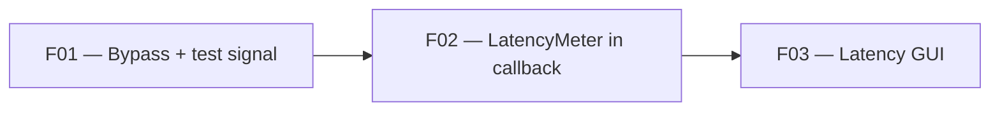

# User stories — Phase F: Latency meter + test-signal re-integration

> Derived from [spec.md](spec.md) — Phase F. All stories are deliverable in under one day and manually testable.

## Overview

Phase F re-integrates three features that existed in the nih-plug plugin path but were not yet wired into the cpal-direct standalone: bypass logic, the 440 Hz test-signal generator, and the latency meter with its GUI readout. The split yields 3 stories with a clear dependency chain — audio-side wiring first, GUI last.

## Stories

| ID                          | Title                                      | Layers          | Size | Notes |
| --------------------------- | ------------------------------------------ | --------------- | ---- | ----- |
| cpal-direct-standalone-F01  | Bypass toggle and 440 Hz test-signal       | Capture+Render  | S    |       |
| cpal-direct-standalone-F02  | LatencyMeter wired into cpal output callback | Capture+Render | S    |       |
| cpal-direct-standalone-F03  | Latency measurement button and readout in GUI | Control surface | S |       |

Sizes: `XS` (half day) · `S` (1 day) — no `M`/`L`, re-split if larger.

The "Layers" column uses the product layers from [product-architecture.md](../product-architecture.md): Capture, Signal chain, Render, Tone state, Control surface, Persistence.

## Proposed dependency graph

F01 lands first because F02's bypass-cancellation logic depends on the bypass path being wired. F03 depends on F02's `LatencyHandle` being available in `AudioSession`.

## Notes for the Technical Refinement

- 🟢 **LatencyMeter unchanged** — the existing `Process` impl in `src/audio/latency.rs` is consumed as-is. No domain-layer modifications needed.
- 🟢 **State-sharing pattern established** — `XrunCounter` (Arc + atomic) is already passed GUI → audio. `LatencyHandle` follows the identical shape (three Arc clones). No new concurrency primitive to design.
- 🟢 **GUI state machine exists** — `src/gui/editor.rs` has a fully working `LatencyDisplay` enum + per-frame poll + `measure_latency()` call + diagnostics. The standalone port is a transliteration, not a design task.
- 🟡 **Sample rate sharing** — the session SR must reach the GUI for `measure_latency()`. An `Arc<AtomicU32>` (bits of `f32`) is the simplest approach matching the existing `XrunCounter` pattern. Confirm this during TR rather than inventing a heavier abstraction.
- 🟡 **Deinterleave scratch buffer size** — the pre-allocated scratch Vec needs a size bound. `MAX_BLOCK_SIZE / channels` is the safe upper bound (currently 65536 / 2 = 32768 for stereo). Confirm during TR that this is acceptable memory-wise (~128 KB).
- 🟡 **Latency meter placement in signal chain** — in the nih-plug plugin, the meter sits after input_gain and before gain_block (channel 0 only). The cpal-direct output callback should replicate this ordering. The input callback is less natural because the meter needs to see the loopback *return* (output routed back to input), so it must process the output-side buffer. Confirm during TR.
- 🟡 **Test-signal in input vs output callback** — the nih-plug plugin injects the sine in Stage 1 (before gain/meter). In cpal-direct, this maps to the *input* callback (before pushing to ring), so the sine flows through the full chain. Confirm during TR.
