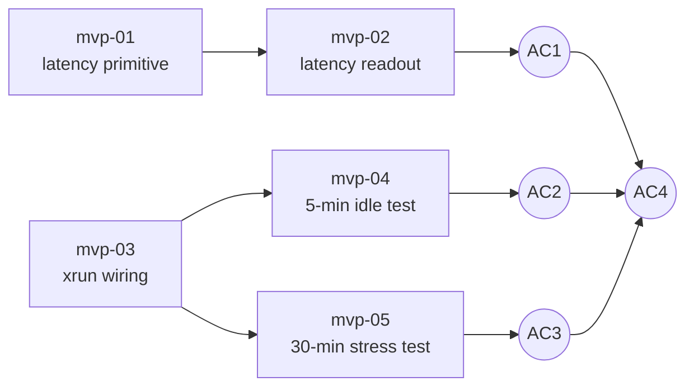

# User stories — MVP: Glitch-free real-time guitar signal path

> Derived from [spec.md](spec.md). All stories are written to be deliverable in under one day and manually testable.

## Overview

The MVP scaffold is already substantial: standalone runs via nih-plug, Gain block + bypass + input/output gain knobs are wired, the GUI editor lays out ParamSliders + xrun label + latency placeholder, `BufferBackend` and boundary-size fixtures exist. The split therefore targets the three gaps that block AC1–AC3: real latency measurement (AC1), an xrun counter that actually counts (AC2), and reproducible stability/stress harnesses (AC2 + AC3). AC4 falls out of the others passing — no story needed beyond the verification protocol. Five stories total.

## Stories

| ID     | Title                              | Layers                                  | Size | Notes          |
| ------ | ---------------------------------- | --------------------------------------- | ---- | -------------- |
| mvp-01 | Latency measurement primitive      | Signal chain                            | XS   |                |
| mvp-02 | Latency readout in the standalone  | Capture + Render + Control surface      | S    | depends on 01  |
| mvp-03 | Wire xrun detection into callback  | Capture + Control surface               | S    | ⚠️ TR required |
| mvp-04 | 5-minute idle stability test       | Capture + Signal chain                  | XS   | depends on 03  |
| mvp-05 | 30-minute stress test with sweeps  | Capture + Signal chain + Tone state     | S    | depends on 03  |

Sizes: `XS` (½ day) · `S` (1 day) — no `M`/`L`, re-split if larger.

The "Layers" column uses the product layers from [product-architecture.md](../product-architecture.md): Capture, Signal chain, Render, Tone state, Control surface, Persistence.

## Proposed dependency graph

> This graph is a proposal. It will be frozen during Technical Refinement.

## Notes for the Technical Refinement

- 🟢 **(resolved) xrun-detection mechanism (mvp-03)** — chosen: **Option A**, wall-clock budget check inside `Plugin::process()` (`0.9 × buffer_duration` threshold), reusing the existing `XrunCounter` + rtrb log bridge plumbing. The known false-negative class (cpal-side input drops invisible to `process()`) is captured as a v0.2 follow-up — see [docs/specs/tech-quality/nih-plug-cpal-xrun-hook.md](../tech-quality/nih-plug-cpal-xrun-hook.md) for the proposed fork change. Resolution detail in [mvp-03 implementation plan §✅ Decisions taken](stories/mvp-03-xrun-detection-wired-implementation-plan.md).
- 🟢 **(resolved) Loopback capture architecture (mvp-02)** — chosen: **Option O**, `LatencyMeter` as a `Process`-implementing block under `src/audio/latency.rs`, with **Option A** as the synchronisation primitive (`Box<[AtomicU32; 4096]>` capture buffer + `Arc<AtomicU8>` state + `Arc<AtomicBool>` trigger). The block is testable through `BufferBackend` exactly like the existing `Gain` block, and establishes the v0.2 multi-block chain pattern. Resolution detail in [mvp-02 implementation plan §✅ Decisions taken](stories/mvp-02-latency-readout-in-standalone-implementation-plan.md).
- 🟡 **30-minute stress timebase (mvp-05)** — running 30 minutes of real wall-clock per `cargo test` invocation is unrealistic for CI. The TR should decide whether the deterministic stress schedule from `dependencies.md` runs at compressed speed via `BufferBackend` (validates the path; does not cover real-device timing) or whether the 30-minute run stays manual and the integration test only covers a shorter equivalent.
- 🟡 **Latency `Result` error type (mvp-01)** — domain `Error` enum currently has only `InvalidSampleRate` ([`src/domain/error.rs`](../../../src/domain/error.rs)). Cross-correlation needs at least one new variant (e.g. weak/no peak found). TR should confirm placement (domain Error vs. local LatencyError).
- 🟢 **Foundations are in place** — `BufferBackend`, `XrunCounter`, `silent_buffer(secs, sr)`, `kronecker_impulse(n)`, `BUFFER_SIZES`, `SAMPLE_RATES`, the `rtrb` audio→log bridge, the `Process` trait (prepare/reset/process), the ParamSlider/SyncSignal/Memo GUI patterns, the `debug-assert-no-alloc` feature, and the lefthook fmt+clippy gate all already exist. Every story slots into existing patterns rather than introducing new ones.
- 🟢 **No persistence work needed** — confirmed by codebase sweep: zero serde, zero preset I/O. MVP scope holds.
- 🟢 **macOS microphone permission** — out of scope per spec ("build on the dev machine; ship later"). The author already grants permission interactively on the dev machine; bundling and Info.plist work belongs to a future packaging story, not the MVP.
